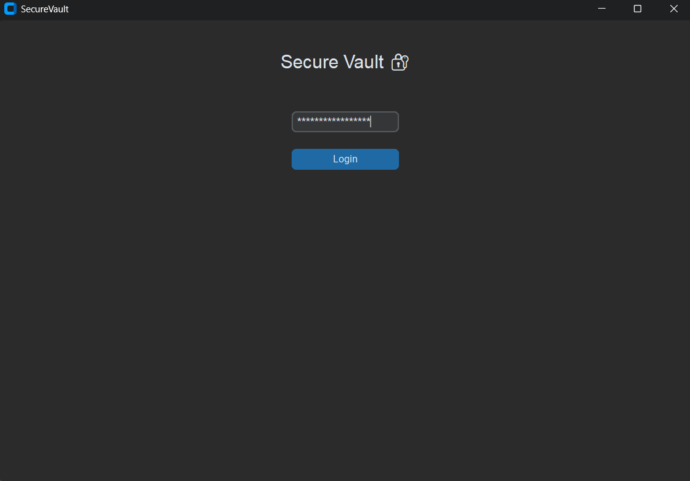
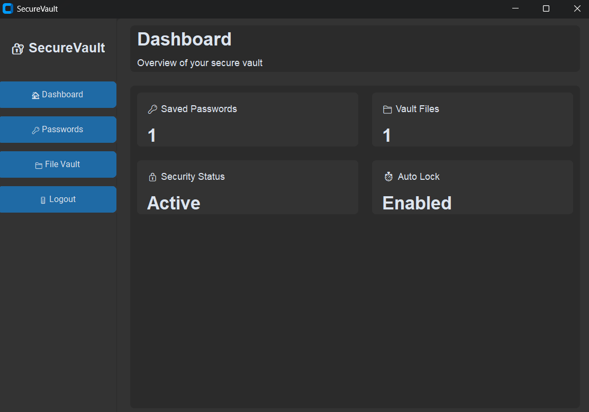
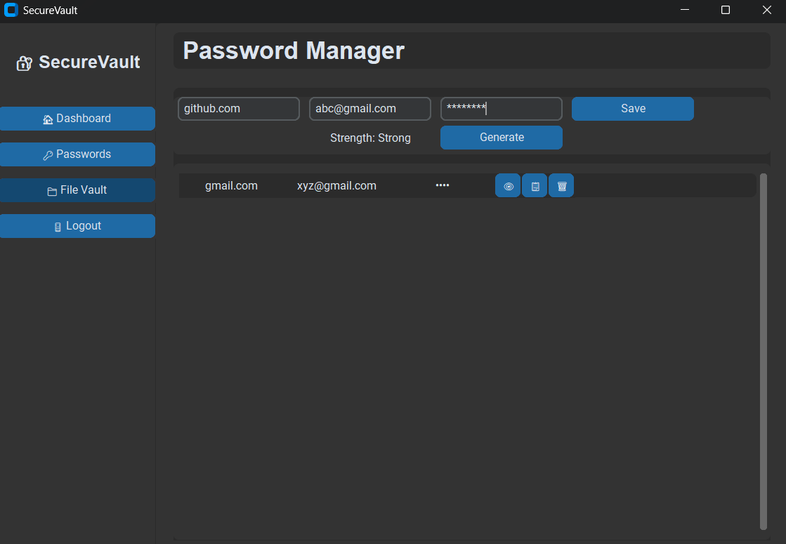
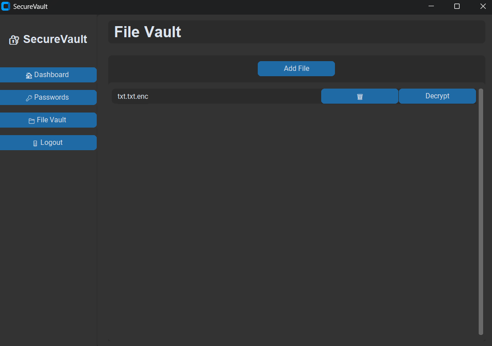

# 🔐 SecureVault

> AES-256 Based Secure File Vault and Encrypted Password Management System Using PBKDF2


SecureVault is a Python-based desktop security application that provides encrypted password management and secure file storage in a single platform. It uses **AES-256** encryption and **PBKDF2-HMAC-SHA256** key derivation to protect your sensitive data locally — no cloud, no internet required.

---

##Features

- **Master Password Authentication** — Your master password is never stored in plaintext; it is transformed into an AES key using PBKDF2 with a unique salt
- **Password Manager** — Add, view, search, and delete encrypted credentials (website, username, password)
- **File Vault** — Upload and encrypt confidential files; decrypt them on demand
- **Auto Logout** — Automatically logs out after 60 seconds of inactivity
- **Clean GUI** — Built with CustomTkinter for a modern desktop experience
- **Portable Executable** — Packaged with PyInstaller; no Python installation needed to run

---

## 🛡️ Security Architecture

```
User
 └── Login Module (Master Password Input)
      └── PBKDF2-HMAC-SHA256 Key Generation (with salt)
           └── Dashboard
                ├── Password Manager ──┐
                └── File Vault ────────┤
                                       ▼
                              AES-256 Encryption Engine
                                       │
                              Local Encrypted Storage
                                       │
                              Auto Logout (60s inactivity)
```

| Layer | Technology |
|---|---|
| Encryption | AES-256 (CBC mode) |
| Key Derivation | PBKDF2-HMAC-SHA256 |
| Salt | Unique per installation |
| GUI Framework | CustomTkinter |
| Deployment | PyInstaller (.exe) |
| Storage | Local filesystem (no cloud) |

---

##Getting Started

### Option A — Run the Executable (Windows, no Python needed)

1. Download the latest release from the [Releases](../../releases) page
2. Run `SecureVault.exe`
3. Set your master password on first launch

### Option B — Run from Source

**Prerequisites:** Python 3.10+

```bash
# Clone the repository
git clone https://github.com/neel-prog/SecureVault.git
cd SecureVault

# Install dependencies
pip install -r requirements.txt

# Run the application
python main.py
```

### Build the Executable Yourself

```bash
pip install pyinstaller
pyinstaller --onefile --windowed main.py
```

The `.exe` will be generated in the `dist/` folder.

---

## 📋 Requirements

See [`requirements.txt`](requirements.txt) for the full dependency list.

**System Requirements:**

| Component | Minimum |
|---|---|
| OS | Windows 10 / Windows 11 |
| Processor | Intel i3 or equivalent |
| RAM | 4 GB |
| Storage | 200 MB free space |
| Internet | Not required |

---

##Project Structure

```
SecureVault/
├── main.py                  # Application entry point
├── auth/
│   ├── login.py             # Login module
│   └── pbkdf2_keygen.py     # PBKDF2 key derivation
├── modules/
│   ├── dashboard.py         # Main dashboard
│   ├── password_manager.py  # Password Manager module
│   └── file_vault.py        # File Vault module
├── crypto/
│   └── aes_engine.py        # AES-256 encryption/decryption engine
├── storage/
│   └── local_store.py       # Encrypted local storage handler
├── utils/
│   └── auto_logout.py       # Session timeout manager
├── assets/                  # GUI icons and resources
├── requirements.txt
└── README.md
```

---

##Screenshots

| Login | Dashboard |
|---|---|
|  |  |

| Password Manager | File Vault |
|---|---|
|  |  |


##Future Scope

- [ ] Two-Factor Authentication (OTP / Authenticator app)
- [ ] Browser extension for auto-fill
- [ ] Biometric authentication (fingerprint / face recognition)
- [ ] Encrypted cloud backup
- [ ] Android & iOS mobile app
- [ ] Multi-device synchronization
- [ ] Built-in strong password generator

---

##Disclaimer

SecureVault is designed for personal use and academic demonstration. While it uses strong cryptographic standards, it has not undergone a formal third-party security audit. Use it at your own discretion for storing highly sensitive data.
